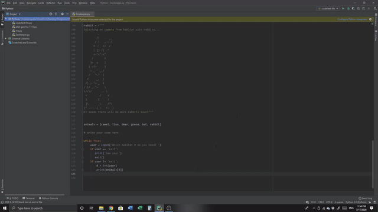

# Python-Projects
I'll be storing the Python projects that I create along my learning process (and for fun, too) in this repository.

Some of the projects will come from HyperSkill, or JetBrains Academy, which I am currently using to learn Python, and some will just come from me being creative and making a project on my own. 

Keep in mind that I have not included my virtual environment for Python programming here, so the experience of running my files and debugging them and what not isn't exactly plug & play. You'll have to create one yourself, or automate one using PyCharm or any other IDE that can do it. Personally, the best experience for me is in PyCharm so you should use that if you're a student (JetBrains IDEs are free for students).

 

Anyway, I hope you have fun looking through this repository and that it serves as inspiration for you create projects of your own!

